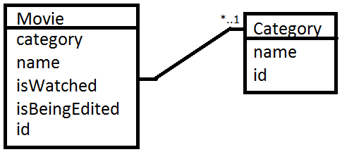

#Watchlist

##Követelményanalízis
Alapvetően ezeket a dolgokat várjunk el a programtól:
* Lehessen új filmeket felvenni
* Lehessen a meglévő filmeket kilistázni
* Lehessen a meglévő filmeket szerkeszteni
* Lehessen a meglévő filmeket törölni
* A filmek perzisztálva legyenek
* A megnézett filmeket meglehessen jelölni

##Tervezés
Az adatmodell a következőképpen néz ki

Mint látható **egy-sok** kapcsolatról van szó, egy kategóriába több film tartozhat.

##Implementáció
A feladat a **cloud9** nevű online IDE-ben készült el, melynek címe **http://c9.io**. 
Teljes értékű fejlesztői felületről van szó, sok nyelvet támogat, és webszervert is képes közvetlenül futtatni, nem utolsó sorban teljesen ingyenes (verziója is van). Fejlesztés közben egy ubuntu rendszer támogat minket a háttérből, mellyel közvetlenül tudunk kommunikálni a megnyitott terminálon keresztül.

A program ember-cli 1.3-as verziót használ, és egy REST API végpont segíti a rendeltetésszerű működését.

A könyvtárstruktúrában lévő mappák funkciói:
* docs -> ebben találhatók a dokumentációval kapcsolatos képek
* app -> az emberjs-t használó apphoz tartozó specifikus fájlok
* node_modules -> az **npm install** kezdetű parancsokkal telepített modulokat tartalmazza

##Tesztelés
"ember test" paranccsal indíthatók automatikus tesztek.

##Felhasználói dokumentáció

###Futtatáshoz ajánlott hardver- és szoftverkonfiguráció
Egyedül egy böngésző szükséges a programhoz, ne legyen túl régi. Ha az elmúlt pár évben frissítetted a böngészőt, akkor egész biztosan működni fog. Egy kifejezetten gyenge gépen is jól illene menni a programnak, mivel a lényegi részek szerveren futnak, a kliensoldalon szinte csak a megjelenítés van. Akár egy böngészőt futtatni képes telefon is elbírja.

###A program használata
Ha éppen fut a program, akkor elérhető a [http://watchlist-ember-soadzoor.c9users.io:8080/](http://watchlist-ember-soadzoor.c9users.io:8080/) oldalon. Az **add** almenüben tudunk filmeket hozzáadni a listához, a **list**-re kattintva jeleníthetjük meg ezeket. Itt ha rákattintunk valamelyikre, akkor szerkesztherjük, megjelölhetjük látottként, és el is távolíthatjuk.

###Telepítés lépései

Legyen **npm**, **phantomjs**, **bower** és **ember-cli** telepítve. (Linuxon npm install -g ember-cli).
Zipként letölthetjük githubról az egész projektet, majd az **ember server** paranccsal indíthatjuk a programot. Fontos, hogy fusson a REST API rész is!

